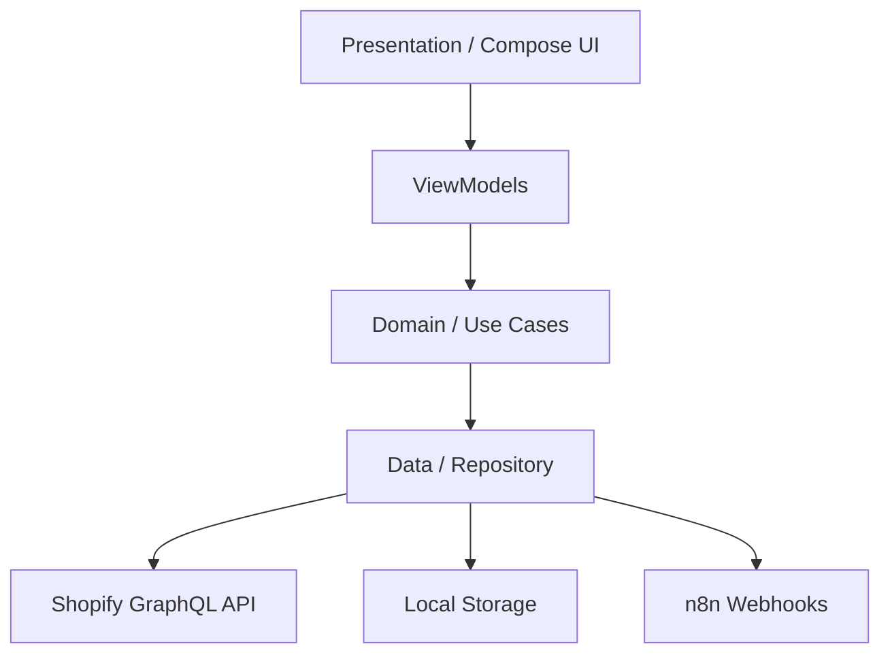

# 🛍️ ShopFlow — Modern E-commerce for Android

[](https://kotlinlang.org/)
[](https://www.android.com/)
[](https://developer.android.com/jetpack/compose)
[](https://www.apollographql.com/)
[](LICENSE)

**ShopFlow** is a production-ready, high-performance Android E-commerce application built with a **Headless Commerce** philosophy. By leveraging the **Shopify Storefront API**, ShopFlow provides a seamless shopping experience with a focus on speed, modern UI/UX, and robust architecture.

---

## 📱 Screenshots

| Home Screen | Product Detail | Shopping Cart |
| :---: | :---: | :---: |
| *[Placeholder]* | *[Placeholder]* | *[Placeholder]* |

| Wishlist | Profile | Checkout |
| :---: | :---: | :---: |
| *[Placeholder]* | *[Placeholder]* | *[Placeholder]* |

---

## ✨ Key Features

- **🔐 Secure Authentication**: Full user lifecycle management including sign-up, login, and secure session handling via Shopify's Multipass/Customer Access Tokens.
- **📦 Product Discovery**: Dynamic product browsing with support for categories, detailed product descriptions, and high-quality image galleries.
- **🛒 Cart Management**: Real-time shopping cart synchronization with persistent storage.
- **💖 Wishlist**: Save your favorite items for later with a dedicated wishlist view.
- **🤖 Abandoned Cart Recovery**: An advanced automation system powered by **n8n Webhooks**. When a user leaves items in their cart without checking out, the app triggers a sophisticated recovery flow via external webhooks to re-engage the customer.
- **🎨 Modern UI**: 100% Jetpack Compose implementation following Material 3 design guidelines for a fluid and responsive experience.

---

## 🛠️ Tech Stack & Libraries

### Core Development
- **Language**: [Kotlin](https://kotlinlang.org/) (100%)
- **Asynchronous**: [Coroutines](https://kotlinlang.org/docs/coroutines-overview.html) & [Flow](https://kotlinlang.org/docs/flow.html)
- **Dependency Injection**: [Dagger Hilt](https://dagger.dev/hilt/)

### UI & UX
- **UI Framework**: [Jetpack Compose](https://developer.android.com/jetpack/compose)
- **Design System**: Material 3
- **Image Loading**: [Coil](https://coil-kt.github.io/coil/)
- **Navigation**: [Compose Navigation](https://developer.android.com/jetpack/compose/navigation)

### Data & Networking
- **API Communication**: [Apollo GraphQL](https://www.apollographql.com/docs/kotlin/) (Shopify Storefront API)
- **Webhooks/REST**: [OkHttp3](https://square.github.io/okhttp/)
- **Local Storage**: [DataStore](https://developer.android.com/topic/libraries/architecture/datastore) / Room

---

## 🏛️ Architecture Overview

ShopFlow strictly adheres to **Clean Architecture** principles and the **MVVM (Model-View-ViewModel)** pattern. This ensures the codebase is highly testable, maintainable, and scalable.



- **Presentation Layer**: Handles UI state and user interaction using Jetpack Compose and ViewModels.
- **Domain Layer**: Contains business logic, Use Cases, and Domain Entities. It is completely independent of other layers.
- **Data Layer**: Implements Repository patterns, manages API calls via Apollo GraphQL, and handles local data persistence.

---

## 🚀 Getting Started

### Prerequisites
- Android Studio Iguana (or newer)
- JDK 17+
- A Shopify Storefront API Key

### Local Setup

1. **Clone the repository:**
   ```bash
   git clone https://github.com/hekal-4e/shopflow-shopify-client
   ```

2. **Configure Environment Variables:**
   Create a `secrets.properties` file in the root directory (or update the existing one) with your Shopify credentials:
   ```properties
   SHOPIFY_ACCESS_TOKEN="your_access_token_here"
   SHOPIFY_STORE_URL="your-store.myshopify.com"
   N8N_WEBHOOK_URL="your_n8n_webhook_url_here"
   ```

3. **Build the project:**
   Sync the project with Gradle files and build the application.

4. **Run the app:**
   Deploy to a physical device or emulator running Android 8.0 (API 26) or higher.

---

## 🗺️ Future Roadmap

- [ ] **Push Notifications**: Real-time order updates and marketing alerts.
- [ ] **Social Authentication**: Google and Apple Sign-in integration.
- [ ] **Multi-Currency Support**: Support for global shopping experiences.
- [ ] **Advanced Search**: Implementation of Algolia or Shopify's native predictive search.
- [ ] **Dark Mode Optimization**: Enhanced accessibility and visual comfort.

---

## 📄 License

This project is licensed under the MIT License - see the [LICENSE](LICENSE) file for details.

---

Built with ❤️ for the E-commerce Community.
