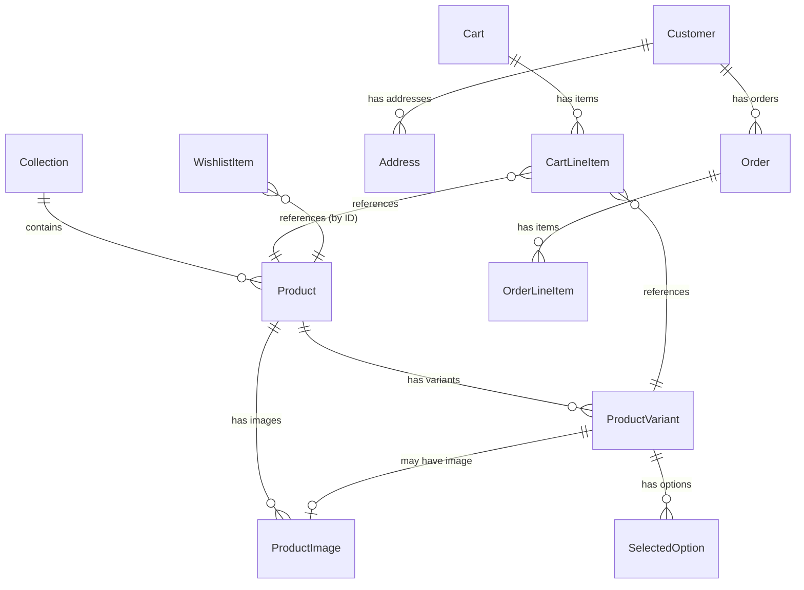

# Data Model: ShopFlow E-Commerce App

**Feature**: `001-shopflow-ecommerce-app`
**Date**: 2026-04-22
**Source**: spec.md Key Entities + Shopify Storefront API schema

> **Convention**: Domain models (Kotlin data classes in the Domain layer) are
> listed below. Data-layer DTOs (Apollo-generated) and Room entities are
> implementation details and will be defined during task execution.

---

## Domain Models

### Product

Represents a Shopify product with display and browsing information.

| Field            | Type                   | Description                                    |
|------------------|------------------------|------------------------------------------------|
| id               | String                 | Shopify product GID                            |
| title            | String                 | Display name                                   |
| description      | String                 | Full product description (HTML stripped)        |
| descriptionHtml  | String                 | Raw HTML description                           |
| brand            | String?                | Vendor / brand name (nullable)                 |
| productType      | String                 | Category label (e.g., "Sneakers", "Audio")     |
| images           | List\<ProductImage\>   | Ordered list of product images                 |
| variants         | List\<ProductVariant\> | Available purchasable variants                 |
| priceRange       | PriceRange             | Min–max price across all variants              |
| rating           | Float?                 | Average rating (nullable, from metafield)      |
| reviewCount      | Int                    | Number of reviews                              |
| collections      | List\<String\>         | Collection IDs this product belongs to         |
| isAvailable      | Boolean                | Whether any variant is in stock                |

### ProductImage

| Field  | Type   | Description                          |
|--------|--------|--------------------------------------|
| url    | String | CDN URL for the image                |
| altText| String?| Accessibility text                   |
| width  | Int?   | Pixel width (for aspect ratio)       |
| height | Int?   | Pixel height                         |

### ProductVariant

| Field          | Type           | Description                               |
|----------------|----------------|-------------------------------------------|
| id             | String         | Shopify variant GID                       |
| title          | String         | Variant display name (e.g., "Size 9 / Magenta") |
| price          | Money          | Unit price                                |
| compareAtPrice | Money?         | Strike-through price (nullable)           |
| selectedOptions| List\<SelectedOption\> | Option name–value pairs (Size, Color) |
| isAvailable    | Boolean        | In stock                                  |
| image          | ProductImage?  | Variant-specific image (nullable)         |

### SelectedOption

| Field | Type   | Description                    |
|-------|--------|--------------------------------|
| name  | String | Option name (e.g., "Size")     |
| value | String | Option value (e.g., "9")       |

### Money

| Field        | Type   | Description              |
|--------------|--------|--------------------------|
| amount       | Double | Numeric value            |
| currencyCode | String | ISO 4217 code ("USD")    |

### PriceRange

| Field    | Type  | Description       |
|----------|-------|-------------------|
| minPrice | Money | Lowest variant    |
| maxPrice | Money | Highest variant   |

---

### Collection (Category)

| Field       | Type             | Description                           |
|-------------|------------------|---------------------------------------|
| id          | String           | Shopify collection GID                |
| title       | String           | Display name (e.g., "Shoes", "Audio") |
| description | String?          | Collection description                |
| image       | ProductImage?    | Hero image for the collection         |
| handle      | String           | URL-safe slug                         |

---

### Cart

Local-only model (not persisted to Shopify until checkout creation).

| Field      | Type                | Description                           |
|------------|---------------------|---------------------------------------|
| id         | String              | Local UUID                            |
| lineItems  | List\<CartLineItem\>| Items in the cart                     |
| subtotal   | Money               | Calculated sum of line item totals    |
| itemCount  | Int                 | Total quantity across all line items   |

### CartLineItem

| Field    | Type           | Description                               |
|----------|----------------|-------------------------------------------|
| id       | String         | Local UUID                                |
| variant  | ProductVariant | The selected variant                      |
| product  | Product        | Parent product (for display data)         |
| quantity | Int            | Number of units (≥ 1)                     |
| total    | Money          | quantity × variant.price                  |

**Validation rules**:
- quantity ≥ 1; maximum 99 per line item.
- Cannot add a variant with `isAvailable = false`.
- Duplicate variant additions increment quantity (no duplicate line items).

---

### Customer

| Field          | Type             | Description                          |
|----------------|------------------|--------------------------------------|
| id             | String           | Shopify customer GID                 |
| firstName      | String           | First name                           |
| lastName       | String           | Last name                            |
| email          | String           | Email address                        |
| phone          | String?          | Phone number (nullable)              |
| defaultAddress | Address?         | Primary shipping address             |
| addresses      | List\<Address\>  | All saved addresses                  |
| accessToken    | String           | Shopify customer access token        |
| tokenExpiry    | Long             | Token expiration timestamp           |

### Address

| Field    | Type    | Description             |
|----------|---------|-------------------------|
| id       | String  | Shopify address GID     |
| address1 | String  | Street line 1           |
| address2 | String? | Street line 2           |
| city     | String  | City                    |
| province | String? | State/province          |
| country  | String  | Country                 |
| zip      | String  | Postal code             |

---

### Order

| Field             | Type                 | Description                          |
|-------------------|----------------------|--------------------------------------|
| id                | String               | Shopify order GID                    |
| orderNumber       | Int                  | Human-readable order number          |
| name              | String               | Display name (e.g., "#SF-2891")      |
| processedAt       | String               | ISO 8601 timestamp                   |
| fulfillmentStatus | FulfillmentStatus    | Enum: UNFULFILLED, PROCESSING, SHIPPED, DELIVERED, CANCELLED |
| totalPrice        | Money                | Order total                          |
| lineItems         | List\<OrderLineItem\>| Items in the order                   |
| shippingAddress   | Address?             | Delivery address                     |
| trackingNumber    | String?              | Shipment tracking ID                 |

### FulfillmentStatus (enum)

`UNFULFILLED` | `PROCESSING` | `SHIPPED` | `DELIVERED` | `CANCELLED`

### OrderLineItem

| Field    | Type           | Description                    |
|----------|----------------|--------------------------------|
| title    | String         | Product title at time of order |
| variant  | String?        | Variant title                  |
| quantity | Int            | Units ordered                  |
| price    | Money          | Unit price at time of order    |
| image    | ProductImage?  | Product image                  |

---

### WishlistItem (local-only, Room entity)

| Field     | Type   | Description                          |
|-----------|--------|--------------------------------------|
| id        | Long   | Auto-generated Room primary key      |
| productId | String | Shopify product GID                  |
| variantId | String?| Preferred variant GID (nullable)     |
| title     | String | Product title (cached for offline)   |
| brand     | String?| Brand name                           |
| imageUrl  | String | Primary image URL (cached)           |
| price     | Double | Price at time of save                |
| currency  | String | Currency code                        |
| addedAt   | Long   | Timestamp of addition                |

**Validation rules**:
- Maximum 100 items per wishlist.
- Duplicate productId additions are silently ignored (no duplicates).

---

### Notification (local-only, Room entity)

| Field      | Type    | Description                             |
|------------|---------|-----------------------------------------|
| id         | Long    | Auto-generated Room primary key         |
| title      | String  | Notification title                      |
| body       | String  | Notification body text                  |
| type       | NotificationType | Enum: ORDER_UPDATE, PROMOTION, WISHLIST_PRICE_DROP |
| deepLink   | String? | Navigation route for tap action         |
| isRead     | Boolean | Read/unread status (default false)      |
| createdAt  | Long    | Timestamp                               |

### NotificationType (enum)

`ORDER_UPDATE` | `PROMOTION` | `WISHLIST_PRICE_DROP`

---

### UserPreferences (DataStore)

| Key                    | Type    | Default   | Description                     |
|------------------------|---------|-----------|---------------------------------|
| onboarding_completed   | Boolean | false     | Whether onboarding was shown    |
| theme_mode             | String  | "dark"    | "dark" or "light"               |
| language_code          | String  | "en"      | ISO 639-1 language code         |
| biometric_enabled      | Boolean | false     | Biometric login toggle          |
| push_notifications     | Boolean | true      | Notification preference         |
| email_marketing        | Boolean | false     | Marketing opt-in                |

---

## Relationships

