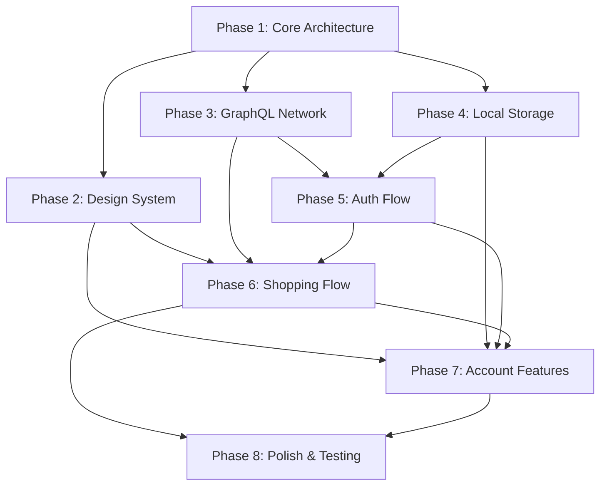

# Implementation Plan: ShopFlow E-Commerce App

**Branch**: `001-shopflow-ecommerce-app` | **Date**: 2026-04-22 | **Spec**: [spec.md](spec.md)
**Input**: Feature specification from `specs/001-shopflow-ecommerce-app/spec.md`

## Summary

ShopFlow is a premium Android e-commerce app powered exclusively by Shopify
Storefront API (GraphQL). Built with Kotlin, Jetpack Compose, strict MVVM +
Clean Architecture, and Dagger Hilt. The "Midnight Cyber-Chic" design system
drives a true-black glassmorphism UI with neon magenta-to-violet gradient
accents. Implementation spans 8 phases from core scaffolding through polish.

## Technical Context

**Language/Version**: Kotlin (latest stable, JVM 17+)
**Primary Dependencies**: Jetpack Compose (BOM-aligned), Apollo Kotlin (GraphQL), Dagger Hilt, Jetpack Navigation Compose, Coil, Room, DataStore, WorkManager
**Storage**: Room (wishlist cache, notifications), DataStore (preferences, encrypted tokens)
**Testing**: JUnit 5, Compose Testing, Turbine (Flow testing), MockK
**Target Platform**: Android 8.0+ (API 26), targeting latest stable SDK
**Project Type**: Mobile app (single-activity, Compose-only)
**Performance Goals**: Product catalog renders <2s, splash→home <5s, 60fps UI
**Constraints**: No Firebase, no XML layouts, no LiveData, offline-capable for cached data
**Scale/Scope**: ~12 screens, single Shopify storefront, single currency at launch

## Constitution Check

*GATE: Must pass before Phase 0 research. Re-check after Phase 1 design.*

| # | Principle | Status | Evidence |
|---|-----------|--------|----------|
| I | Kotlin-First, Compose-Only UI | ✅ PASS | All UI in Jetpack Compose, no XML layouts |
| II | Strict MVVM + Clean Architecture | ✅ PASS | Data/Domain/Presentation layers, inward dependency flow |
| III | Dagger Hilt for DI | ✅ PASS | Constructor injection, @AndroidEntryPoint, scoped modules |
| IV | StateFlow/SharedFlow | ✅ PASS | No LiveData; injected dispatchers; viewModelScope only |
| V | Shopify Storefront API Only | ✅ PASS | Apollo Kotlin GraphQL; no Firebase; sealed Result wrapper |
| VI | Midnight Cyber-Chic Design | ✅ PASS | ShopFlowTheme wraps all Material 3 tokens; design tokens table in spec |
| VII | SOLID / DRY / KISS | ✅ PASS | Single-module to start (KISS); use cases per feature; interface-driven repos |

**Gate result**: ALL PASS — proceed to implementation.

## Project Structure

### Documentation (this feature)

```text
specs/001-shopflow-ecommerce-app/
├── plan.md              # This file
├── spec.md              # Feature specification (with UI design reference)
├── research.md          # Phase 0 output — technology decisions
├── data-model.md        # Phase 1 output — domain entity definitions
├── quickstart.md        # Phase 1 output — developer setup guide
├── contracts/
│   └── shopify-storefront-api.md  # GraphQL query/mutation contracts
└── tasks.md             # Phase 2 output (/speckit.tasks — NOT YET CREATED)
```

### Source Code (repository root)

```text
app/
├── src/main/
│   ├── java/com/shopflow/app/
│   │   ├── ShopFlowApp.kt                    # @HiltAndroidApp
│   │   ├── MainActivity.kt                   # Single Activity host
│   │   │
│   │   ├── data/                              # ── DATA LAYER ──
│   │   │   ├── remote/
│   │   │   │   ├── ShopifyDataSource.kt       # Apollo client wrapper
│   │   │   │   └── interceptor/               # Auth header interceptor
│   │   │   ├── local/
│   │   │   │   ├── ShopFlowDatabase.kt        # Room database
│   │   │   │   ├── dao/                        # WishlistDao, NotificationDao
│   │   │   │   ├── entity/                     # Room entities
│   │   │   │   └── datastore/                  # Preferences, TokenStore
│   │   │   ├── repository/                    # Repository implementations
│   │   │   └── mapper/                         # DTO ↔ Domain mappers
│   │   │
│   │   ├── domain/                            # ── DOMAIN LAYER ──
│   │   │   ├── model/                          # Domain data classes
│   │   │   ├── repository/                    # Repository interfaces
│   │   │   └── usecase/                        # Business logic use cases
│   │   │       ├── product/
│   │   │       ├── cart/
│   │   │       ├── auth/
│   │   │       ├── checkout/
│   │   │       ├── order/
│   │   │       ├── wishlist/
│   │   │       └── profile/
│   │   │
│   │   ├── presentation/                      # ── PRESENTATION LAYER ──
│   │   │   ├── navigation/
│   │   │   │   ├── ShopFlowNavGraph.kt
│   │   │   │   ├── Routes.kt                  # Sealed route hierarchy
│   │   │   │   └── BottomNavBar.kt
│   │   │   ├── theme/
│   │   │   │   ├── ShopFlowTheme.kt
│   │   │   │   ├── Color.kt
│   │   │   │   ├── Type.kt
│   │   │   │   └── Shape.kt
│   │   │   ├── components/                    # Shared composables
│   │   │   │   ├── GradientButton.kt
│   │   │   │   ├── GlassmorphismCard.kt
│   │   │   │   ├── ProductCard.kt
│   │   │   │   ├── SearchBar.kt
│   │   │   │   ├── ChipSelector.kt
│   │   │   │   └── ...
│   │   │   └── screens/
│   │   │       ├── splash/
│   │   │       │   └── SplashScreen.kt
│   │   │       ├── onboarding/
│   │   │       │   ├── OnboardingScreen.kt
│   │   │       │   └── OnboardingViewModel.kt
│   │   │       ├── auth/
│   │   │       │   ├── LoginScreen.kt
│   │   │       │   ├── RegisterScreen.kt
│   │   │       │   └── AuthViewModel.kt
│   │   │       ├── home/
│   │   │       │   ├── HomeScreen.kt
│   │   │       │   └── HomeViewModel.kt
│   │   │       ├── product/
│   │   │       │   ├── ProductDetailScreen.kt
│   │   │       │   └── ProductDetailViewModel.kt
│   │   │       ├── cart/
│   │   │       │   ├── CartScreen.kt
│   │   │       │   └── CartViewModel.kt
│   │   │       ├── checkout/
│   │   │       │   ├── CheckoutScreen.kt
│   │   │       │   └── CheckoutViewModel.kt
│   │   │       ├── confirmation/
│   │   │       │   └── OrderConfirmationScreen.kt
│   │   │       ├── profile/
│   │   │       │   ├── ProfileScreen.kt
│   │   │       │   └── ProfileViewModel.kt
│   │   │       ├── orders/
│   │   │       │   ├── OrderHistoryScreen.kt
│   │   │       │   └── OrderHistoryViewModel.kt
│   │   │       ├── wishlist/
│   │   │       │   ├── WishlistScreen.kt
│   │   │       │   └── WishlistViewModel.kt
│   │   │       ├── notifications/
│   │   │       │   ├── NotificationScreen.kt
│   │   │       │   └── NotificationViewModel.kt
│   │   │       └── settings/
│   │   │           ├── SettingsScreen.kt
│   │   │           └── SettingsViewModel.kt
│   │   │
│   │   └── di/                                # Hilt modules
│   │       ├── NetworkModule.kt
│   │       ├── DatabaseModule.kt
│   │       ├── RepositoryModule.kt
│   │       └── DataStoreModule.kt
│   │
│   ├── graphql/                               # .graphql files (Apollo codegen)
│   │   ├── schema.graphqls
│   │   ├── queries/
│   │   └── mutations/
│   └── res/
│       ├── values/strings.xml
│       ├── values-fr/, values-de/, etc.       # Translations
│       └── font/                              # Inter / Outfit
│
├── src/test/                                  # Unit tests
│   └── java/com/shopflow/app/
│       ├── domain/usecase/
│       └── presentation/viewmodel/
├── src/androidTest/                           # Instrumented/UI tests
│   └── java/com/shopflow/app/
│       └── presentation/screens/
│
├── build.gradle.kts
└── gradle/libs.versions.toml                  # Version catalog
```

**Structure Decision**: Single-module Clean Architecture enforced by package
boundaries (`data/`, `domain/`, `presentation/`). KISS principle — module
extraction deferred until build times justify it.

---

## Implementation Phases

### Phase 1 — Core Architecture & Project Scaffolding

**Goal**: Bootable app shell with DI, theme, navigation, and empty screens.

**Scaffolding approach** (for Implementer Agent):
1. Create Android project via `android-cli` with Compose activity template.
2. Configure `libs.versions.toml` with all dependencies.
3. Set up `build.gradle.kts` with Hilt, Apollo, Room, Compose plugins.
4. Create package structure: `data/`, `domain/`, `presentation/`.
5. Implement `ShopFlowApp.kt` (`@HiltAndroidApp`).
6. Implement `MainActivity.kt` (`@AndroidEntryPoint`, `setContent`).
7. Build `ShopFlowTheme` (Color.kt, Type.kt, Shape.kt) per design tokens.
8. Create sealed `Routes` and `ShopFlowNavGraph` with placeholder screens.
9. Build `BottomNavBar` composable with 5 icon tabs.
10. Create all Hilt `@Module` stubs (Network, Database, Repository, DataStore).

**Deliverables**: App compiles, launches to splash → Home (empty) with bottom nav.

**Constitution gates**: Compose-only UI ✅, Hilt DI ✅, ShopFlowTheme ✅.

---

### Phase 2 — Design System & Reusable Components

**Goal**: Build the shared component library per the Midnight Cyber-Chic spec.

**Components to build** (referencing `spec.md` UI Design Reference):
1. `GradientButton` — Magenta→Violet gradient pill, configurable text/icon.
2. `OutlinedButton` — Zinc border, no fill variant (e.g., "Continue Shopping").
3. `GlassmorphismCard` — Semi-transparent surface with blur, rounded 16dp.
4. `ProductCard` — Image, wishlist heart, premium label, price, add-to-cart.
5. `SearchBar` — Glassmorphism pill, search icon, mic icon, placeholder.
6. `ChipSelector` — Horizontal chip row (size, color, brand, sort, filter).
7. `CategoryIcon` — Circular icon container with magenta ring (active state).
8. `StepIndicator` — Horizontal 3-step stepper (address → payment → confirm).
9. `QuantityStepper` — Minus/count/plus inline control.
10. `StatusBadge` — Color-coded pill (green/amber/cyan) for order statuses.
11. `ToggleRow` — Label + subtitle + magenta toggle switch.
12. `NavigationRow` — Title + subtitle + trailing chevron, dark card.
13. `AvatarCircle` — Initials avatar with magenta ring border.
14. `NotificationBadge` — Bell icon with unread count overlay.

**Deliverables**: All components with `@Preview` composables. Storybook-style preview.

---

### Phase 3 — Shopify GraphQL Network Layer

**Goal**: Apollo client, data sources, DTOs, mappers, and repository wiring.

**Scaffolding approach**:
1. Download Shopify Storefront API schema → `src/main/graphql/schema.graphqls`.
2. Create `.graphql` files per contracts (Q-001→Q-007, M-001→M-005).
3. Run Apollo codegen → verify generated Kotlin types compile.
4. Implement `NetworkModule` — OkHttpClient with auth interceptor, ApolloClient.
5. Implement `ShopifyDataSource` — wraps Apollo calls, returns raw responses.
6. Create domain model data classes (from `data-model.md`).
7. Implement DTO→Domain mappers for each entity.
8. Define repository interfaces in `domain/repository/`.
9. Implement repository classes in `data/repository/`.
10. Wire repositories in `RepositoryModule` (`@Binds`).
11. Implement sealed `ApiResult<T>` wrapper per contracts.

**Deliverables**: Full network layer compiles. Repositories inject via Hilt.
Unit tests for mappers and repositories (with mocked data source).

---

### Phase 4 — Local Storage Layer

**Goal**: Room database, DAOs, DataStore, and offline-capable repositories.

**Scaffolding approach**:
1. Define Room entities: `WishlistItemEntity`, `NotificationEntity`.
2. Create DAOs: `WishlistDao`, `NotificationDao`.
3. Create `ShopFlowDatabase` with entities and DAOs.
4. Implement `DatabaseModule` (Hilt `@Provides` for database + DAOs).
5. Implement `PreferencesDataStore` — onboarding, theme, language, toggles.
6. Implement `TokenDataStore` — encrypted customer access token storage.
7. Create `DataStoreModule` (Hilt `@Provides`).
8. Update repositories to merge remote + local data (offline fallback).

**Deliverables**: Room DB + DataStore operational. Wishlist persists across sessions.

---

### Phase 5 — Authentication Flow

**Goal**: Login, Register, social login UI and business logic.

**Screens** (per spec UI reference — Screens 06 & 07):
1. Build `LoginScreen` — email/password fields, "Sign In" gradient CTA,
   social buttons (Google/Apple), "Forgot Password?" link, footer navigation.
2. Build `RegisterScreen` — name/email/password fields, password strength
   indicator, terms checkbox, "Create Account" CTA, social buttons.
3. Implement `AuthViewModel` — login/register state, validation, error handling.
4. Create auth use cases: `LoginUseCase`, `RegisterUseCase`, `LogoutUseCase`,
   `RefreshTokenUseCase`.
5. Implement auth repository (Shopify `customerAccessTokenCreate`,
   `customerCreate` mutations).
6. Wire token persistence (DataStore) and auto-refresh on expiry.
7. Implement auth state management — global `isAuthenticated` StateFlow
   consumed by NavGraph for route guarding.

**Deliverables**: User can register, login, logout. Auth gates checkout.

---

### Phase 6 — Shopping Flow (Browse → Cart → Checkout → Confirmation)

**Goal**: Complete purchase funnel end-to-end.

**Screens** (per spec UI reference — Screens 01, 02, 03, 04, 05):

1. **Splash & Onboarding** (Screen 01):
   - `SplashScreen` — logo, gradient glow, 2–3s timer.
   - `OnboardingScreen` — 3-slide horizontal pager, dot indicator, "Get Started" CTA.
   - `OnboardingViewModel` — persists completion via DataStore.

2. **Home** (Screen 02):
   - `HomeScreen` — greeting bar, search bar, hero banner pager, category row,
     featured product grid.
   - `HomeViewModel` — fetches collections, featured products, banner data.
   - Use cases: `GetCollectionsUseCase`, `GetFeaturedProductsUseCase`,
     `SearchProductsUseCase`.

3. **Product Details** (Screen 03):
   - `ProductDetailScreen` — image carousel, info section, size/color selectors,
     description, "Add to Cart" CTA.
   - `ProductDetailViewModel` — fetches product, manages variant selection,
     add-to-cart action.
   - Use cases: `GetProductDetailUseCase`, `AddToCartUseCase`.

4. **Cart & Checkout** (Screen 04):
   - `CartScreen` — line items with quantity steppers, delivery address card,
     payment card visual, order summary, "Proceed to Checkout" CTA.
   - `CartViewModel` — local cart state, quantity updates, subtotal calculation.
   - `CheckoutViewModel` — creates Shopify checkout, launches Custom Tab.
   - Use cases: `UpdateCartUseCase`, `RemoveFromCartUseCase`,
     `CreateCheckoutUseCase`.

5. **Order Confirmation** (Screen 05):
   - `OrderConfirmationScreen` — particle confetti, pulsing checkmark halo,
     tracking card, "Track Order" + "Continue Shopping" CTAs.
   - Deep-link receiver to capture checkout completion from Custom Tab.

**Deliverables**: Full purchase funnel functional. Checkout opens Shopify web
checkout and returns to confirmation.

---

### Phase 7 — Account & Retention Features

**Goal**: Profile, orders, wishlist, notifications, settings screens.

**Screens** (per spec UI reference — Screens 08, 09, 10, 11):

1. **Wishlist** (Screen 08):
   - `WishlistScreen` — item cards, filter bottom sheet (price range, brand,
     sort chips), "Apply Filters" CTA.
   - `WishlistViewModel` — Room-backed CRUD, filtering/sorting logic.
   - Use cases: `GetWishlistUseCase`, `AddToWishlistUseCase`,
     `RemoveFromWishlistUseCase`, `FilterWishlistUseCase`.

2. **Profile** (Screen 09):
   - `ProfileScreen` — avatar, name, email, premium badge, stats row,
     navigation menu rows.
   - `ProfileViewModel` — fetches customer data from Shopify.
   - Use cases: `GetCustomerProfileUseCase`, `UpdateCustomerProfileUseCase`.

3. **Order History** (Screen 10):
   - `OrderHistoryScreen` — filter tabs (All/Active/Delivered/Cancelled),
     order cards with status badges, "Track Order" buttons.
   - `OrderHistoryViewModel` — fetches orders, filters by status.
   - Use cases: `GetOrderHistoryUseCase`.

4. **Settings** (Screen 11):
   - `SettingsScreen` — preference toggles (notifications, dark theme,
     biometric, email marketing), language chips, account/security rows.
   - `SettingsViewModel` — reads/writes DataStore preferences.

5. **Notifications**:
   - `NotificationScreen` — notification list, read/unread state, badge.
   - `NotificationViewModel` — Room-backed, marks as read.
   - WorkManager job for periodic order-status polling.

**Deliverables**: All account screens functional. Wishlist persists locally.
Settings toggle theme/language in real-time.

---

### Phase 8 — Polish, Testing & Quality

**Goal**: Production-readiness — tests, accessibility, performance, edge cases.

1. **Unit tests**: All use cases, all ViewModels, all mappers.
   Coverage: Domain ≥80%, Presentation ≥60%.
2. **UI tests**: Critical flows — onboarding, login, browse→cart→checkout.
3. **Offline handling**: Cached product display, retry buttons, error states.
4. **Edge cases**: Token expiry refresh, unavailable cart items, wishlist limits.
5. **Accessibility**: Content descriptions, contrast verification (WCAG AA).
6. **Performance**: Lazy loading, image caching, smooth animations (60fps).
7. **Micro-animations**: Scale/fade on card press, shimmer loading states,
   confetti on order confirmation, pulsing halo effect.
8. **Localization**: String extraction, RTL support verification.
9. **ProGuard/R8**: Minification rules, Apollo keep rules.
10. **Final lint sweep**: ktlint, detekt, Compose lint rules.

**Deliverables**: Release-ready APK. All quality gates pass.

---

## Phase Dependency Graph



## Complexity Tracking

> No constitution violations requiring justification. All principles satisfied.

| Decision | Rationale | KISS Validation |
|----------|-----------|-----------------|
| Single Gradle module | Package-level layer enforcement | Module split deferred until build times >60s |
| Local wishlist (Room) | Storefront API has no wishlist endpoint | Simplest viable approach |
| Polling for notifications | Firebase prohibited, no custom backend | WorkManager periodic sync |
| Web checkout (Custom Tab) | Storefront API has no payment processing | Official Shopify pattern |
